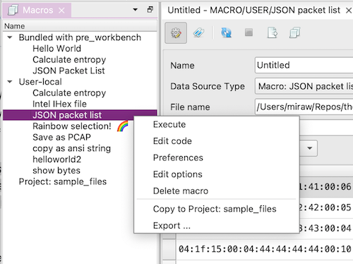
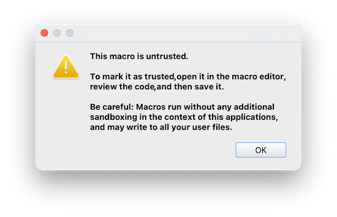

# Plugin and Macro Support

## Plugins
Plugin support is currently experimental and needs to be explicitly enabled.

You can load all *.py files from a folder as plugins, by setting a Plugin Directory in the settings dialog, 
or by running PRE Workbench with the `--plugins-dir=...` argument.

Plugins can e.g. register custom file types, dock widgets or selection heuristics.

The best way to develop plugins is to open your plugin directory as a PyCharm project and configure PyCharm to use
the virtualenv in which your PRE Workbench is installed. This way, you get full autocomplete support on internal objects.

* [Example Plugins](https://github.com/luelista/prewb_example_plugins)

## Macros

### Editing

To manage macros, use the *Macros* tool window (View > Tool Windows > Macros). There you can create, import, export, edit
and run your macros.

Macros can be stored in your user directory (`~/.config` or `%APPDATA%`) and in the project database (`.pre_workbench`).
Additionally, some example macros are bundled with the application.

You can also copy macros between the different storage locations (builtin, user, project).

Macros without a required input object (Input Type = NONE) can be directly run from the tool window by double-clicking.



### Security Model

**Macros run in-process, without any sandboxing - they have the same permissions as you running the app.** 
Therefore macros are TOFE (Trust On First Edit), so if you load a new project file from somewhere else, or import a new macro,
you need to first open each macro in the editor, carefully review it, and save it again. 
A hash of the code is then stored in your local config, marking it as trusted. It can then be run from the usual locations.



<a name="macro-properties-help"></a>
### Data Types
Macros can specify a combined "Macro / Input Type", and an "Output Type".
The Output Type is currently ignored.
The Input Types are used to specify in which places a macro can be executed.
Input to the macro is provided in a variable named `input`, which is directly 
usable in the macro code.
Types not listed below are not implemented yet / reserved for future use.

#### NONE
The macro has no input. It can be executed by double-clicking it in the
Macros tool window.

#### BYTE_BUFFER
The macro expects a single [ByteBuffer](#bytebuffer) as input. It can be executed by right-clicking
a packet in a PacketListWidget or in the context menu of a HexView.
If multiple packets are selected, the macro is called repeatedly.

#### BYTE_BUFFER_LIST
The macro expects a [ByteBufferList](#bytebufferlist) as input. It can be executed in the
same ways as a BYTE_BUFFER macro, but is only called once.

#### BYTE_ARRAY
The macro expects a `bytes` type (sequence of bytes without metadata).
It can be executed in the HexView context menu after
selecting a byte range.

#### DATA_SOURCE
The macro shows up in the *Data Source Type* select box in the Data Source Window.
It's output (to be placed in the `output` variable by the macro) will
be displayed in the Data Source Window's output widget.


<a name="macro-code-help"></a>

## API

### Global Helper Functions
The following helper functions are available to macros without any additional import statements. To use them in a plugin, add the following import:

```py title="To use macro environment in plugin:"
from pre_workbench.macros.macroenv import *
```

#### System browser
```py
navigateBrowser(url: str)
```

<div class="result" markdown>

Opens the system web browser on the specified URL.

</div>

#### Clipboard access
```py
getClipboardText() -> str
```
<div class="result" markdown>
Returns the text contents of the system clipboard.
</div>

```py
setClipboardText(text: str)
```
<div class="result" markdown>
Sets the contents of the system clipboard to the given text.
</div>

#### Dialogs

```py
alert(msg, title)
```
<div class="result" markdown>
Displays a messagebox with the specified message and title.
</div>

```py
confirm(msg, title) -> bool
```
<div class="result" markdown>
Displays a messagebox with OK and Cancel buttons. Returns True if the user clicks OK.
</div>

```py
prompt(msg, defaultText, title) -> (str, bool)
```
<div class="result" markdown>
Displays a text input dialog asking the user for one line of text. Returns the entered string and a boolean which is True if the user clicks OK.
</div>

```py
showScintillaDialog(parent, title, content, ok_callback, readonly=False, 
                    lexer=None, help_callback=None) -> str | None
```
<div class="result" markdown>

Example usage for a readonly dialog:  
`showScintillaDialog(MainWindow, "View results", my_result_string, None, readonly=True)`

Example usage for an editor dialog:  
`edited_data = showScintillaDialog(MainWindow, "Edit data", initial_data, None)`

</div>

```py
showListSelectDialog(listOptions: List[Tuple[Any, str]], selectedOption, 
                     title: str="Select ...", parent=None, ok_callback=None, 
                     multiselect=False, help_callback=None)
```
<div class="result" markdown>
Displays a dialog which allows the user to select one or more items from a list box.
</div>


#### Logging

```py
log(msg, *args, **kwargs)
```
<div class="result" markdown>
Logs a message with level INFO. The arguments are interpreted as in [logging.debug](https://docs.python.org/3/library/logging.html#logging.debug).
</div>

```py
logging.debug(), logging.info(), logging.warning(), logging.error()
```
<div class="result" markdown>
See [Python reference](https://docs.python.org/3/library/logging.html#logger-objects).
</div>


#### Object display

```py
zoom(obj: ByteBuffer | ByteBufferList | List[ByteBuffer])
```
<div class="result" markdown>
Temporarily displays an object in the "Zoom" tool window.
</div>

```py
openAsUntitled(obj: ByteBuffer | ByteBufferList | List[ByteBuffer] | str)
```
<div class="result" markdown>
Open a new untitled file with the specified contents.

| Parameter type | Which window type is opened |
|-|-|
| ByteBuffer | HexFileWindow | 
|  ByteBufferList or List[ByteBuffer] | PcapngFileWindow |
|  str | TextFileWindow |
</div>


### Available Classes

#### ByteBuffer
*Defined in pre_workbench/objects.py*

##### constructor
```py
ByteBuffer(buffer: bytes, metadata: Dict[str, any])
```

Returns a new ByteBuffer object.

##### Methods

* `toHexDump(offset=0, length=None) -> str`
* `toHex(offset=0, length=None, joiner="", format="%02x") -> str`
* `len(buffer) -> int`

##### Properties

* `buffer.buffer -> bytearray`
* `buffer.metadata -> Dict[str, any]`

#### ByteBufferList
*Defined in pre_workbench/objects.py*

##### constructor
```py
ByteBufferList()
```

Returns a new ByteBufferList object.

##### Methods
* `list.add(obj: ByteBufferList)`

##### Properties
* `list.buffers -> List[ByteBuffer]`
* `list.metadata -> Dict[str, any]`

#### MainWindow
*Defined in pre_workbench/mainwindow.py*

Accessible as global variable `MainWindow`.

Reference to the application main window. Can be used as the parent for dialogs.
